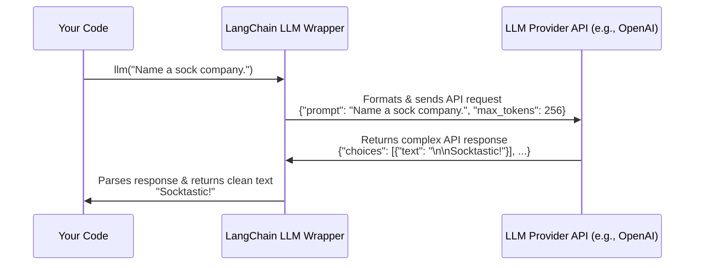

# Chapter 1: LLM Wrappers

Welcome to the LangChain Tutorial! We're thrilled to have you here. In this first chapter, we'll start with the most fundamental building block in LangChain: the **LLM Wrapper**.

### The Universal Remote for Language Models

Imagine you have three different TVs at home: a Sony, a Samsung, and an LG. Each one comes with its own remote control, and they all have slightly different buttons and layouts. It's a bit of a hassle to remember which remote does what.

Now, imagine you have a **universal remote**. You program it once for each TV, and suddenly, you can use the same remote—with the same power button, volume buttons, and channel buttons—to control any of them. Life is simpler!

This is exactly what an **LLM Wrapper** does in LangChain. There are many Large Language Models (LLMs) out there—like OpenAI's GPT-4, Google's Gemini, and thousands of open-source models on Hugging Face. Each has its own way of being called. The LLM Wrapper is your universal remote, giving you a single, consistent way to interact with any of them.

Our goal in this chapter is simple: to ask a language model a question and get an answer back using LangChain. Let's get started!

### Your First LLM Call with OpenAI

Let's ask an LLM for some help with a creative task: naming a company. First, you'll need to connect to an LLM provider. We'll start with OpenAI.

**A Quick Note on Setup:** To use services like OpenAI, you'll need an "API key". Think of this as a password that proves you have an account. Make sure you have your key set up in your environment before running the code.

Here's how you can create an "instance" or a copy of the OpenAI LLM.

```python
# main.py
from langchain.llms import OpenAI

# We set temperature to 0.9 for more creative responses.
llm = OpenAI(temperature=0.9)
```

In this tiny snippet, we've done two things:
1.  We imported the `OpenAI` wrapper from LangChain.
2.  We created our "universal remote" and called it `llm`. The `temperature=0.9` part is like a creativity dial. `0.0` is very predictable and factual, while `1.0` is highly creative and random.

Now, let's use our `llm` object to ask a question!

```python
# main.py
prompt = "What would be a good company name for a company that makes colorful socks?"

# The "call" button on our universal remote
response = llm(prompt)

print(response)
```

When you run this, the `llm` object sends your prompt to OpenAI's servers, gets the answer, and hands it back to you.

**Example Output:**

```text
"Socktastic!"
```

Just like that, you've connected to and prompted a powerful language model in just a few lines of code!

### The Magic: Swapping Models Instantly

Okay, so we've used OpenAI. But what if we want to try a different model, maybe one from Hugging Face, a popular hub for open-source AI models? This is where the beauty of the LLM Wrapper shines.

Notice how we change the setup, but the way we *use* the LLM stays exactly the same.

```python
# hf.py
from langchain.llms import HuggingFaceHub

# Set up the remote for a different "brand" of LLM
llm = HuggingFaceHub(repo_id="google/flan-t5-xxl")

prompt = "translate English to German: How old are you?"

# The "call" button is the same!
response = llm(prompt)

print(response)
```

We swapped `OpenAI` for `HuggingFaceHub` and provided a `repo_id` (which is just the model's name on the Hugging Face website). But the most important part—the `llm(prompt)` call—remains identical. You don't need to learn a new way to call the model.

**Example Output:**

```text
Wie alt bist du?
```

You've just switched from an OpenAI model to a Google model running on Hugging Face without changing your core logic. That's the power of the universal remote!

### How It Works Under the Hood

What is LangChain actually doing when you write `llm(prompt)`? It seems simple, but the wrapper is handling a few important steps for you.

Let's visualize the process.



Here’s the step-by-step breakdown:
1.  **You Call the Wrapper:** Your code calls the `llm` object with a simple string of text (your prompt).
2.  **Wrapper Formats the Request:** The wrapper knows exactly how the underlying provider (like OpenAI or Hugging Face) wants to receive the prompt. It packages your text into a formal API request, adding any parameters you specified, like `temperature`.
3.  **Wrapper Makes the API Call:** The wrapper sends this formatted request over the internet to the LLM provider's servers.
4.  **Provider Returns a Response:** The provider's server processes the request and sends back a detailed response, usually in a complex format called JSON.
5.  **Wrapper Parses the Response:** This is a key step! The wrapper sifts through the complex JSON to find the actual text answer you care about.
6.  **Wrapper Returns Clean Text:** The wrapper gives you back a simple, clean string, hiding all the messy API details.

All this complexity is managed for you by the LLM Wrapper, leaving you with a clean and simple interface.

### What We've Learned and What's Next

In this chapter, you learned about the most fundamental concept in LangChain:
- **LLM Wrappers** act as a universal remote, giving you a single, consistent way to talk to any language model.
- You can easily instantiate a model from providers like **OpenAI** or **Hugging Face**.
- The real power is being able to **swap out models** with minimal code changes.

You now have the basic tool to communicate with an LLM. But what if you want to build something more powerful? What if you want to use variables in your prompts or connect multiple LLM calls together?

That's where our next topic comes in. We'll see how to go from a simple prompt to a reusable, dynamic template by using LangChain's next core component.

Ready to level up? Let's dive into [Chains](02_chains_.md).

---

