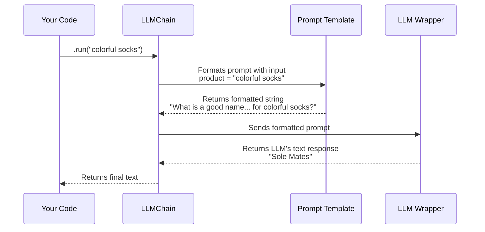

# Chapter 2: Chains

In [Chapter 1: LLM Wrappers](01_llm_wrappers_.md), we learned how to use LangChain as a "universal remote" to talk to any Large Language Model. It was powerful, but also a bit simple. We could only send a single, fixed prompt at a time.

What if you want to build something more dynamic? What if you want to use variables in your prompts, or connect multiple LLM calls together to perform a more complex task?

This is where **Chains** come in.

### From a Single Worker to an Assembly Line

Imagine you're running a factory. The LLM Wrapper we used in the last chapter is like having a single, talented worker. You can give this worker one task, and they'll do it well.

But what if you need to build something complex, like a car? One worker can't do it all. You need an **assembly line**.

1.  **Station 1:** Shapes the metal for the car body.
2.  **Station 2:** Takes the car body and paints it.
3.  **Station 3:** Takes the painted body and adds the wheels.

The car moves from one station to the next, with each station adding something new until the final product is ready.

**Chains in LangChain are exactly like this assembly line.** They let you connect different components (like prompt templates, LLMs, or other chains) in a sequence. Data flows from one step to the next, getting processed and built upon until you have your final result.

### Your First, Simplest Chain: `LLMChain`

Let's build the simplest possible assembly line. It will have just two stations:

1.  A **Prompt Template** to create the instructions for our LLM.
2.  An **LLM** to follow those instructions.

The chain that connects these two is called `LLMChain`.

#### Station 1: The Prompt Template

A Prompt Template is like a letter with blank spaces. You can use it over and over again, just filling in the blanks with different information each time. In Python, it's very similar to an f-string.

Let's create a template for our company naming task. Notice the `{product}` part—that's our blank space, or "variable."

```python
# template_and_chain.py
from langchain import PromptTemplate

template = "What is a good name for a company that makes {product}?"

prompt_template = PromptTemplate.from_template(template)
```
This `prompt_template` object now holds our reusable recipe for creating prompts.

#### Station 2: The LLM

This is the same LLM Wrapper we created in the last chapter. It's our worker, ready to receive instructions.

```python
# template_and_chain.py
from langchain.llms import OpenAI

# Our "universal remote" for the OpenAI model
llm = OpenAI(temperature=0.9)
```

#### Assembling the Chain

Now, let's connect our two stations together using `LLMChain`. This officially creates our mini-assembly line.

```python
# template_and_chain.py
from langchain.chains import LLMChain

# Create the chain, connecting the LLM and the prompt template
name_generation_chain = LLMChain(llm=llm, prompt=prompt_template)
```

And that's it! Our chain is ready to go.

#### Running the Chain

To run our assembly line, we call the `.run()` method. We just need to provide the value for the `{product}` blank we left in our template.

```python
# template_and_chain.py
# Run the chain with the product "colorful socks"
response = name_generation_chain.run("colorful socks")

print(response)
```

**Example Output:**

```text

Sole Mates
```
The magic is that we can reuse this chain with any product!

```python
# Run the same chain with a different product
print(name_generation_chain.run("eco-friendly water bottles"))
```

**Example Output:**

```text

AquaPure
```

We've created a reusable, dynamic tool instead of just a one-off prompt.

### How a Simple Chain Works Under the Hood

When you call `chain.run("colorful socks")`, what's actually happening?


1.  **You Call `.run()`**: You start the assembly line by providing the input, `"colorful socks"`.
2.  **Chain Sends Input to Template**: The `LLMChain` takes your input and sends it to the first station, the `PromptTemplate`.
3.  **Template Formats the Prompt**: The `PromptTemplate` fills in the `{product}` blank, creating the final, complete prompt string.
4.  **Chain Sends Prompt to LLM**: The chain takes this complete prompt and sends it to the second station, the `LLM`.
5.  **LLM Generates Response**: The LLM does its work and generates a company name.
6.  **Chain Returns the Result**: The chain passes the final output back to you.

### Linking Chains Together: `SimpleSequentialChain`

Now for the really cool part. What if one assembly line isn't enough? Let's build a bigger one by connecting two chains together.

Our goal:
1.  **Chain 1**: Generate a company name for a product.
2.  **Chain 2**: Take that company name and write a slogan for it.

LangChain makes this easy with a `SimpleSequentialChain`.

First, we need our two separate `LLMChain`s. The first one is the `name_generation_chain` we already built.

Now let's build the second one, for the slogan.

```python
# simple_sequential_chain.py

# Slogan-generating chain
prompt_slogan = PromptTemplate.from_template("Write a catchphrase for the company: {company_name}")
slogan_chain = LLMChain(llm=llm, prompt=prompt_slogan)
```

This chain expects a variable called `{company_name}`.

Now, let's link them. A `SimpleSequentialChain` takes a list of chains and runs them in order. The output of the first chain automatically becomes the input for the second.

```python
# simple_sequential_chain.py
from langchain.chains import SimpleSequentialChain

# The master chain that connects our two smaller chains
overall_chain = SimpleSequentialChain(chains=[name_generation_chain, slogan_chain])
```

Let's run our master chain!

```python
# simple_sequential_chain.py

# Run the master chain with our product
slogan = overall_chain.run("gaming mice")

print(slogan)
```

**Example Output:**
```text

"Precision in the Palm of Your Hand."
```

It worked! The `SimpleSequentialChain` handled passing the company name from the first chain to the second one completely behind the scenes.

### What We've Learned and What's Next

In this chapter, we've moved from single LLM calls to building intelligent systems:

-   **Chains** are the core of LangChain, acting like assembly lines to perform complex tasks.
-   **`PromptTemplate`** allows you to create reusable, dynamic prompts with variables.
-   **`LLMChain`** is the most fundamental chain, connecting a prompt template with an LLM.
-   **`SimpleSequentialChain`** lets you link multiple chains together, where the output of one becomes the input for the next.

So far, our LLM is working with the general knowledge it was trained on. But what if we want to ask questions about our *own* private data? How can we make the LLM an expert on a specific PDF document or a company's internal wiki?

To do that, we need to give the LLM access to new information. That's a job for our next topic.

Ready to give your LLM a library card? Let's dive into [Retrieval-Augmented Generation (RAG)](03_retrieval_augmented_generation__rag__.md).

---

