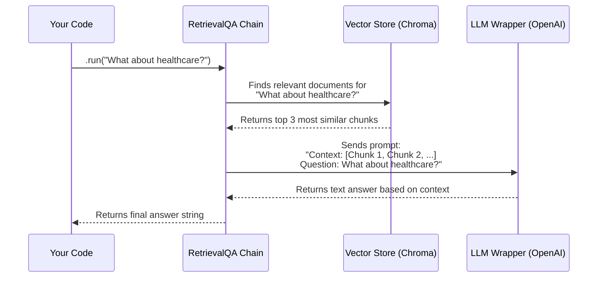

# Chapter 3: Retrieval-Augmented Generation (RAG)

In [Chapter 2: Chains](02_chains_.md), we learned to build powerful assembly lines that connect different language model tasks. Our LLM could generate creative text and even follow a sequence of instructions. However, it was still limited by its own internal knowledge—the vast but generic information it was trained on.

What if you want to ask questions about something the LLM has never seen before, like your company's private documents or a new PDF report? Trying to ask about this information would be like asking a history professor about the plot of a brand-new movie. They simply don't have the information.

This is the problem that **Retrieval-Augmented Generation (RAG)** solves. It's a powerful way to give your LLM "open-book access" to your own data.

### The Open-Book Exam vs. The Closed-Book Exam

Imagine a brilliant student taking an exam.

-   **A Closed-Book Exam:** The student must answer questions relying only on what they have memorized. This is how LLMs work by default. Their knowledge is vast but fixed.
-   **An Open-Book Exam:** The student can bring the textbook to the exam. When asked a question, they don't just guess; they first *look up* the relevant chapter in the book and then formulate an answer based on what they find. The answer is more accurate and grounded in the provided source material.

RAG turns a "closed-book" LLM into an "open-book" one. It retrieves relevant information from your documents *first* and then uses that information to generate a well-informed answer.

### The RAG Pipeline: A Step-by-Step Guide

To give our LLM this open-book capability, we need to build a small pipeline. Let's imagine our goal is to build a Q&A bot for the 2020 State of the Union address. The process has four main steps:

1.  **Load:** First, we need to load the document into our program.
2.  **Split:** LLMs can't process very long documents at once. So, we'll split our long document into smaller, bite-sized chunks.
3.  **Store:** We need an efficient way to find the most relevant chunks later. We do this by turning each chunk into a mathematical representation (an "embedding") and storing them in a special kind of database called a **Vector Store**. Think of this as creating a super-detailed index for our open book.
4.  **Retrieve & Generate:** When a user asks a question, we first search the Vector Store for the most relevant chunks. Then, we pass these chunks, along with the user's question, to the LLM to generate the final answer.

Let's build this step-by-step in code.

#### Step 1: Loading Documents

LangChain has many "Document Loaders" for all kinds of file types, like text files, PDFs, and CSVs. For this example, we'll use a simple `TextLoader`.

```python
# documentQA.py
from langchain.document_loaders import TextLoader

# Load the text from the file
loader = TextLoader('./2020_state_of_the_union.txt', encoding="utf-8")
documents = loader.load()
```
Here, `documents` is a list containing the content of our text file. It's as if we've opened the book.

#### Step 2: Splitting the Document into Chunks

Now, we need to break our long document into smaller pieces. A `RecursiveCharacterTextSplitter` is great for this. It tries to split text by paragraphs, then sentences, and so on, to keep related pieces of text together.

```python
# documentQA.py
from langchain.text_splitter import RecursiveCharacterTextSplitter

# Create the splitter
text_splitter = RecursiveCharacterTextSplitter(chunk_size=1000, chunk_overlap=200)

# Split the document into chunks
texts = text_splitter.split_documents(documents)
```
We've set `chunk_size` to 1000 characters and added a small `chunk_overlap` to ensure we don't lose context between chunks. We've just torn our book into neatly organized index cards.

#### Step 3: Storing Chunks in a Vector Store

This is the most magical part. We need a way to search our text chunks based on *meaning*, not just keywords. To do this, we use two components:

*   **Embeddings:** An embedding model turns a piece of text into a list of numbers (a "vector") that captures its semantic meaning. Similar texts will have similar vectors.
*   **Vector Store:** This is a special database that is highly efficient at finding vectors that are similar to each other. We will use `Chroma` as our vector store.

Let's create the embeddings and store our chunks in Chroma.

```python
# documentQA.py
from langchain.embeddings import OpenAIEmbeddings
from langchain.vectorstores import Chroma

# Create the embedding model
embeddings = OpenAIEmbeddings()

# Store the document chunks in a Chroma vector store
store = Chroma.from_documents(texts, embeddings, collection_name="sotu_2020")
```
This single line, `Chroma.from_documents`, does a lot of work! It takes each text chunk, uses `OpenAIEmbeddings` to turn it into a vector, and then stores that vector in the `Chroma` database. Our searchable index is now complete!

#### Step 4: Building the Q&A Chain

Finally, we assemble everything into a chain. LangChain provides a pre-built chain specifically for this purpose called `RetrievalQA`. It knows exactly how to handle the "retrieve, then generate" logic.

```python
# documentQA.py
from langchain import OpenAI
from langchain.chains import RetrievalQA

# The LLM to generate the answer
llm = OpenAI(temperature=0)

# The chain that connects our components
chain = RetrievalQA.from_chain_type(llm, retriever=store.as_retriever())
```
We've given the chain our [LLM Wrapper](01_llm_wrappers_.md) and a `retriever` (which is just a way of telling it how to search our Chroma vector store).

Now, we can ask questions!

```python
# documentQA.py
question = "What did the president say about healthcare?"
response = chain.run(question)

print(response)
```
**Example Output:**
```text
 The president said that he has made a commitment to Americans with pre-existing conditions that they will always be protected, and that he will always protect patients with pre-existing conditions. He also mentioned a plan that would reduce the cost of health insurance and prescription drugs.
```
The answer is specific and based directly on the content of the State of the Union address, not on the LLM's general knowledge. We've successfully built an open-book Q&A bot!

### How RAG Works Under the Hood

The `RetrievalQA` chain handles a complex sequence of events for you automatically. Let's visualize what happens when you call `chain.run(question)`.


1.  **You Call `.run()`**: You ask your question.
2.  **Chain Queries the Vector Store**: The `RetrievalQA` chain takes your question and sends it to the vector store's retriever. The retriever first converts your question into an embedding (a vector).
3.  **Vector Store Finds Relevant Chunks**: The vector store searches its database for the text chunks whose vectors are most similar to your question's vector. It returns these chunks to the chain.
4.  **Chain Builds a New Prompt**: This is the "Augmented" part of RAG. The chain takes the relevant chunks it retrieved and combines them with your original question into a single, large prompt. It's essentially saying to the LLM, "Using only the following information `[...chunks...]`, please answer this question: `What about healthcare?`"
5.  **Chain Sends Prompt to LLM**: The chain sends this new, context-rich prompt to the LLM.
6.  **LLM Generates Answer**: The LLM generates an answer based *only* on the context it was given, which ensures the answer is grounded in your document.
7.  **Chain Returns the Result**: You get a clean, final answer back.

### What We've Learned and What's Next

In this chapter, you've unlocked one of the most practical and powerful patterns in AI today:

-   **Retrieval-Augmented Generation (RAG)** allows an LLM to answer questions about your private data.
-   The process involves **Loading** documents, **Splitting** them into chunks, **Storing** them in a Vector Store, and finally **Retrieving** them to answer questions.
-   The `RetrievalQA` chain is a convenient way to assemble all these components.

Our Q&A bot is incredibly powerful, but it has one major limitation: it's forgetful. If you ask a follow-up question, it has no idea what you talked about before. Each question is treated as a completely new conversation.

How can we give our application a short-term memory, so it can have a real, back-and-forth conversation? That's the perfect challenge for our next chapter.

Ready to give your bot a memory? Let's dive into [Memory](04_memory_.md).

---

