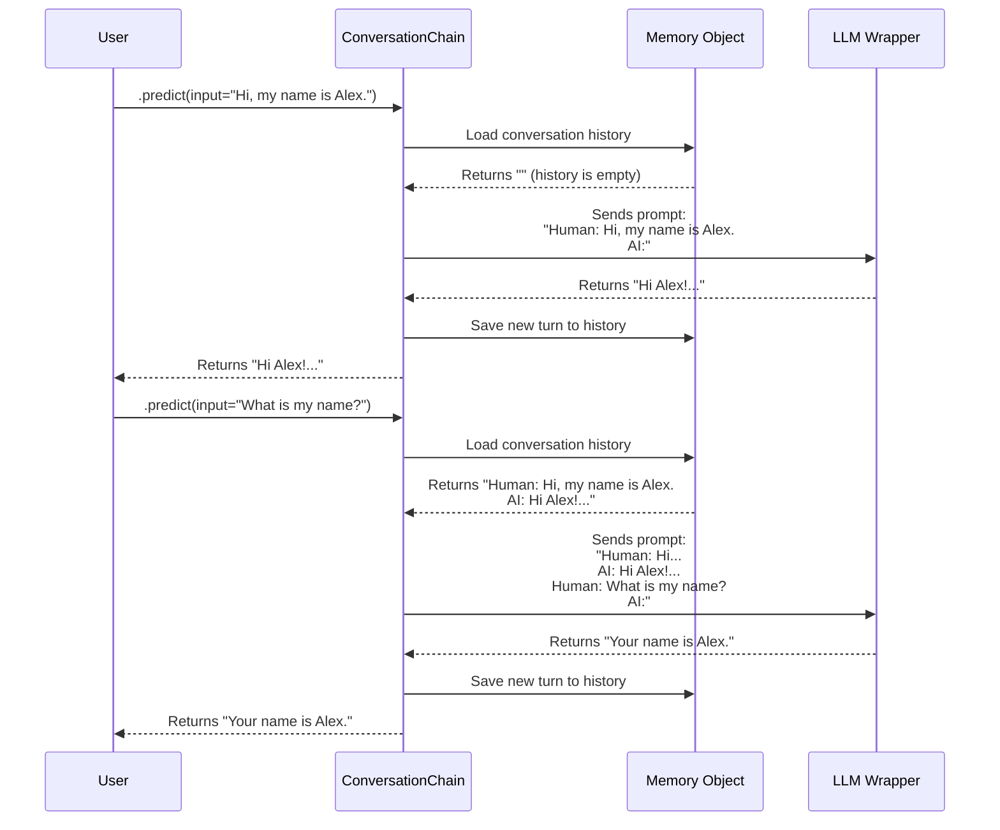

# Chapter 4: Memory

In [Chapter 3: Retrieval-Augmented Generation (RAG)](03_retrieval_augmented_generation__rag__.md), we built a powerful Q&A bot that could answer questions about a specific document. It was smart, but it was also forgetful. If you asked, "Who is the main character?" and then followed up with "What is their goal?", the bot would have no idea who "they" were. Each question was a brand-new interaction.

This is because, by default, Large Language Models are **stateless**. They have no memory of past conversations. It’s like talking to a person who has no short-term memory—you have to start from scratch every single time you speak.

This is the problem that **Memory** solves. It gives your LLM application the ability to remember what was said before, creating a continuous and natural conversation.

### The Friend Who Remembers

Imagine you're having a conversation with a friend.

-   **A Forgetful Friend (No Memory):**
    -   You: "I'm thinking of visiting Paris."
    -   Friend: "Paris is a great city!"
    -   You: "What's the best thing to see there?"
    -   Friend: "Where are you talking about?"

-   **A Remembering Friend (With Memory):**
    -   You: "I'm thinking of visiting Paris."
    -   Friend: "Paris is a great city!"
    -   You: "What's the best thing to see there?"
    -   Friend: "In Paris? You absolutely have to see the Eiffel Tower."

The second conversation feels natural because your friend remembers the context ("Paris"). LangChain's Memory component gives your LLM this exact ability. It acts like a little notebook, automatically recording the conversation and showing it to the LLM before it answers your next question.

### Building a Chatbot That Remembers

Let's build a simple chatbot that can hold a conversation. Our goal is to ask it a question and then ask a follow-up that relies on the first question's context.

The simplest way to do this is with the `ConversationChain`. This chain comes pre-packaged with a Memory component, making it incredibly easy to get started.

First, let's set up our LLM and the `ConversationChain`.

```python
# chat.py
from langchain import OpenAI, ConversationChain

# Our trusted "universal remote" for the OpenAI LLM
llm = OpenAI(temperature=0)

# The ConversationChain is a chain with a memory
conversation = ConversationChain(llm=llm)
```
Notice how simple this is. We didn't even have to explicitly create a memory object; the `ConversationChain` handles it for us by default.

Now, let's have a conversation with it. We'll use the `.predict()` method to send our messages.

#### First Turn

Let's tell our chatbot our name.

```python
# chat.py
# First turn
response = conversation.predict(input="Hi, my name is Alex.")
print(response)
```
**Example Output:**
```text
 Hi Alex! It's nice to meet you. How can I help you today?
```

So far, so good. Now for the real test. Will it remember our name in the next turn?

#### Second Turn

Let's ask a follow-up question.

```python
# chat.py
# Second turn
response = conversation.predict(input="What is my name?")
print(response)
```

**Example Output:**
```text
 Your name is Alex.
```

It worked! The `ConversationChain` remembered the context from our first message and used it to answer the second. We've successfully created a stateful chatbot.

### How Memory Works Under the Hood

The magic of Memory seems complex, but the core idea is surprisingly simple. The chain is essentially keeping a running transcript of the conversation and stuffing it into the prompt each time.

Let's visualize the step-by-step process of our two-turn conversation.



Here's the breakdown:

1.  **First Call ("My name is Alex"):**
    *   The `ConversationChain` asks the Memory for any existing history. The Memory returns an empty string.
    *   The chain formats a prompt containing just the new input: `"Human: Hi, my name is Alex."`
    *   The LLM responds.
    *   Crucially, the chain then **saves** both the user's input and the AI's output back into the Memory object.

2.  **Second Call ("What is my name?"):**
    *   The chain again asks the Memory for the history. This time, Memory returns the first turn of the conversation.
    *   The chain **prepends the history** to the new input, creating a full conversational prompt: `"Human: Hi, my name is Alex. AI: Hi Alex!... Human: What is my name?"`
    *   This complete context is sent to the LLM.
    *   The LLM now has all the information it needs to know that "my name" refers to "Alex".
    *   The chain saves this second turn to memory, and the process repeats.

This "load, predict, save" cycle is the fundamental pattern behind all Memory components in LangChain. By managing the conversation history, Memory turns a stateless LLM into a stateful conversational partner.

### What We've Learned and What's Next

In this chapter, you learned how to overcome one of the biggest limitations of LLMs:
-   **LLMs are stateless**, meaning they don't remember past interactions by default.
-   LangChain's **Memory** component solves this by storing, loading, and passing conversation history as context.
-   The **`ConversationChain`** is a simple yet powerful tool that comes with Memory built-in, allowing you to create chatbots that have coherent, multi-turn conversations.

So far, we've built applications that can generate text, use our private data, and remember conversations. But our LLM is still just a "brain in a jar." It can't interact with the outside world. It can't search the web, run code, or use a calculator.

What if we could give our LLM a set of tools and the intelligence to decide which tool to use and when? That would transform it from a simple chatbot into an autonomous problem-solver.

Ready to give your LLM hands and feet? Let's dive into [Agents and Tools](05_agents_and_tools_.md).

---

