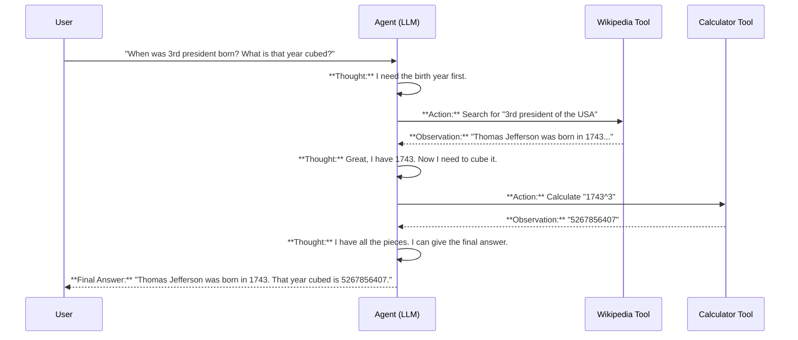

# Chapter 5: Agents and Tools

In [Chapter 4: Memory](04_memory_.md), we gave our chatbot a memory, allowing it to hold a natural, back-and-forth conversation. Our applications are getting smarter, but they are still living in a bubble. They can't do things we take for granted, like check the current weather, solve a math problem, or look up information on the web. They are a "brain in a jar," powerful in thought but unable to act.

This is where **Agents and Tools** come in. This concept transforms your LLM from a simple conversationalist into an autonomous worker that can use tools to actively solve problems.

### From a Smart Friend to a Resourceful Assistant

Imagine you have a very smart personal assistant. You don't just ask them for their opinion; you give them tasks to complete in the real world.

-   **You:** "What's the capital of France, and can you book me a flight there?"
-   **A "Brain in a Jar" LLM:** "The capital of France is Paris. I am a large language model and cannot book flights."
-   **A Resourceful Assistant (An Agent):** "The capital is Paris. Okay, I'll use the 'Flight Booker' app to search for flights. What dates are you thinking of?"

An agent is like this resourceful assistant. It uses the LLM's reasoning ability not just to *answer* a question, but to decide what *actions* to take. You give it a toolbox, and it figures out which tool to use, in what order, to accomplish your goal.

### Our Use Case: A Two-Step Problem

Let's give our application a task that a standard LLM would likely fail at:

**"When was the 3rd president of the USA born? What is that year cubed?"**

This is tricky because:
1.  **Fact-finding:** The LLM needs to know who the 3rd president was and their birth year. It might know this, but it could also be wrong (this is called "hallucination").
2.  **Math:** LLMs are notoriously bad at precise arithmetic. They are language predictors, not calculators.

To solve this reliably, our application needs two tools: a way to look up facts (like Wikipedia) and a calculator. An Agent is what will intelligently use both.

### Building an Agent

Let's build an agent that can tackle our problem. This involves three main steps:
1.  **Get an LLM:** The "brain" of our agent.
2.  **Get Tools:** The set of abilities we'll give our agent (e.g., Search, Calculator).
3.  **Create the Agent:** Combine the LLM and the tools into a single, autonomous agent.

#### Step 1: The LLM Brain

First, we need our LLM. We'll use OpenAI and set `temperature=0` because we want our agent to be as logical and predictable as possible in its reasoning.

```python
# action.py
from langchain.llms import OpenAI

# The "brain" of our agent.
llm = OpenAI(temperature=0)
```
This is the same [LLM Wrapper](01_llm_wrappers_.md) we've been using all along. It will power the agent's decision-making process.

#### Step 2: The Toolbox

Next, we need to give our agent its tools. LangChain provides a simple `load_tools` function to get pre-built tools. We'll give our agent a Wikipedia search tool and a math tool.

```python
# action.py
from langchain.agents import load_tools

# The agent's "toolbox"
tools = load_tools(["wikipedia", "llm-math"], llm=llm)
```
We are providing a list of tool names we want. The `llm-math` tool is special; it uses an LLM to turn natural language ("what is 25 times 4?") into a mathematical expression and solve it.

#### Step 3: Assembling the Agent

Now we combine the brain and the toolbox using `initialize_agent`. We also need to tell it which *type* of agent to be. `ZERO_SHOT_REACT_DESCRIPTION` is a great, general-purpose choice.

```python
# action.py
from langchain.agents import initialize_agent, AgentType

# Assembling the agent from its components
agent = initialize_agent(
    tools,
    llm,
    agent=AgentType.ZERO_SHOT_REACT_DESCRIPTION,
    verbose=True
)
```
-   `tools`: Our list of tools.
-   `llm`: Our reasoning engine.
-   `agent=...`: The agent's "operating system" or thinking style.
-   `verbose=True`: This is fantastic for learning! It makes the agent "think out loud," showing you its entire reasoning process step-by-step.

#### Running the Agent

Now, let's give the agent our difficult prompt and see how it does.

```python
# action.py
prompt = "When was the 3rd president of the USA born? What is that year cubed?"

agent.run(prompt)
```

**Example Output (you'll see something like this):**
```text
> Entering new AgentExecutor chain...
Thought: I need to find the birth year of the 3rd US president and then calculate the cube of that year.
Action: wikipedia
Action Input: 3rd president of the USA
Observation: Thomas Jefferson (April 13, 1743 – July 4, 1826) was an American statesman...
Thought: I have the birth year, 1743. Now I need to cube it.
Action: llm-math
Action Input: 1743^3
Observation: Answer: 5267856407
Thought: I now know the final answer.
Final Answer: The 3rd president of the USA, Thomas Jefferson, was born in 1743. That year cubed is 5267856407.

> Finished chain.
```

Success! The agent correctly identified the two sub-problems, used the right tool for each one, and combined the results into a perfect final answer.

### How an Agent "Thinks": The ReAct Framework

What you just saw in the `verbose` output is the agent's thought process. The `ZERO_SHOT_REACT_DESCRIPTION` agent type uses a framework called **ReAct**, which stands for **Reason, Act, Observe**.

It’s a loop that mimics how a human would solve a problem:

1.  **Reason (Thought):** The agent looks at the problem and thinks, "What is the first logical step I should take to solve this?"
2.  **Act (Action):** Based on its thought, it chooses a tool from its toolbox and decides what input to give that tool.
3.  **Observe (Observation):** It runs the tool and gets a result. This is the new piece of information it has to work with.

The agent repeats this loop—Reason, Act, Observe—until it has gathered enough information to answer the original question.

Let's visualize this loop for our example:



This simple loop allows the agent to break down complex, multi-step problems into a series of smaller, manageable tasks.

### Planning for More Complex Tasks

The ReAct framework is great for simple, sequential problems. But what about a task like, "Plan a 3-day trip to Paris and create a budget"? This requires more than just reacting; it requires a high-level *plan*.

LangChain also has more advanced agents for these scenarios. One such type is a **Plan and Execute Agent**.

As the name suggests, it works in two phases:
1.  **Planner:** First, it creates a step-by-step plan to solve the problem (e.g., "1. Search for popular attractions. 2. Group them by location. 3. Estimate travel and food costs.").
2.  **Executor:** Then, it executes each step in the plan, using its tools as needed.

Setting this up is similar. We give it tools, but we also explicitly define a `planner` and an `executor`.

```python
# plan.py
# (Setup for tools and model is done here)
...

planner = load_chat_planner(model)
executor = load_agent_executor(model, tools, verbose=True)

agent = PlanAndExecute(planner=planner, executor=executor, verbose=True)

agent.run("Where are the next summer olympics going to be hosted? What is the population of that country, squared?")
```
You don't need to master this right away. The key takeaway is that LangChain provides different agent types for different kinds of problems, from simple reactive tasks to complex, planned-out projects.

### What We've Learned and a Look Back

In this chapter, we've given our LLM hands and feet, turning it into a true problem-solver:
-   **Agents** use an LLM's reasoning to decide what actions to take.
-   **Tools** are the functions an agent can call, allowing it to interact with the world (search, calculate, etc.).
-   The **ReAct** framework (Reason, Act, Observe) is a common and powerful thinking process for agents.
-   For more complex problems, there are advanced agents that can create and execute multi-step **plans**.

Congratulations! You've made it through the core concepts of the LangChain framework. From the basic [LLM Wrappers](01_llm_wrappers_.md) to the complex reasoning of Agents, you've seen the fundamental building blocks for creating powerful and intelligent applications.

You've learned to:
-   Connect to any LLM with a unified interface.
-   Build dynamic and reusable logic with [Chains](02_chains_.md).
-   Ground your LLM with your own private data using [RAG](03_retrieval_augmented_generation__rag__.md).
-   Give your applications conversational abilities with [Memory](04_memory_.md).
-   Empower your LLM to act autonomously with **Agents and Tools**.

You now have the foundational knowledge to go out and build the next generation of LLM-powered applications. The journey doesn't end here; it's just beginning. Happy building

---

