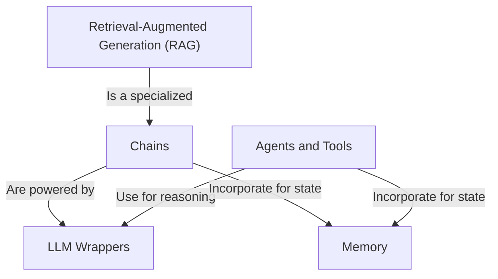

# Tutorial: LangChainTutorial

This project is a hands-on tutorial for the `LangChain` framework, demonstrating how to build powerful AI applications. It showcases fundamental concepts like connecting to **LLMs** (the *brain*), linking them together in **Chains** to perform multi-step tasks, and creating smart **Agents** that can use *tools* like a web search. The project also covers how to give your application **Memory** for conversations and use **Retrieval-Augmented Generation (RAG)** to answer questions based on your own private documents.

**Source Repository:** [https://github.com/fancellu/langChainDemo](https://github.com/fancellu/langChainDemo)

## Chapters

1. [LLM Wrappers
](01_llm_wrappers_.md)
2. [Chains
](02_chains_.md)
3. [Retrieval-Augmented Generation (RAG)
](03_retrieval_augmented_generation__rag__.md)
4. [Memory
](04_memory_.md)
5. [Agents and Tools
](05_agents_and_tools_.md)

---

